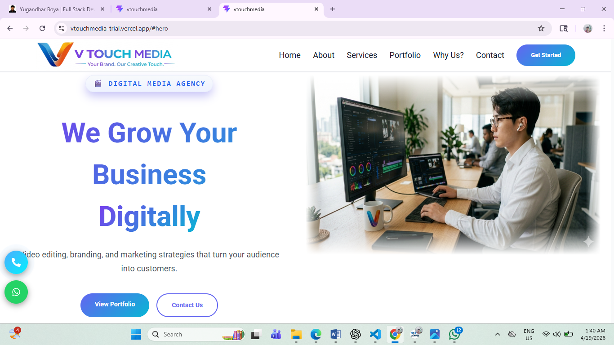
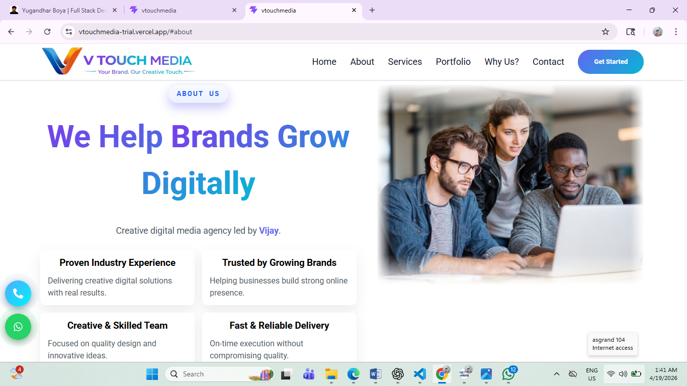
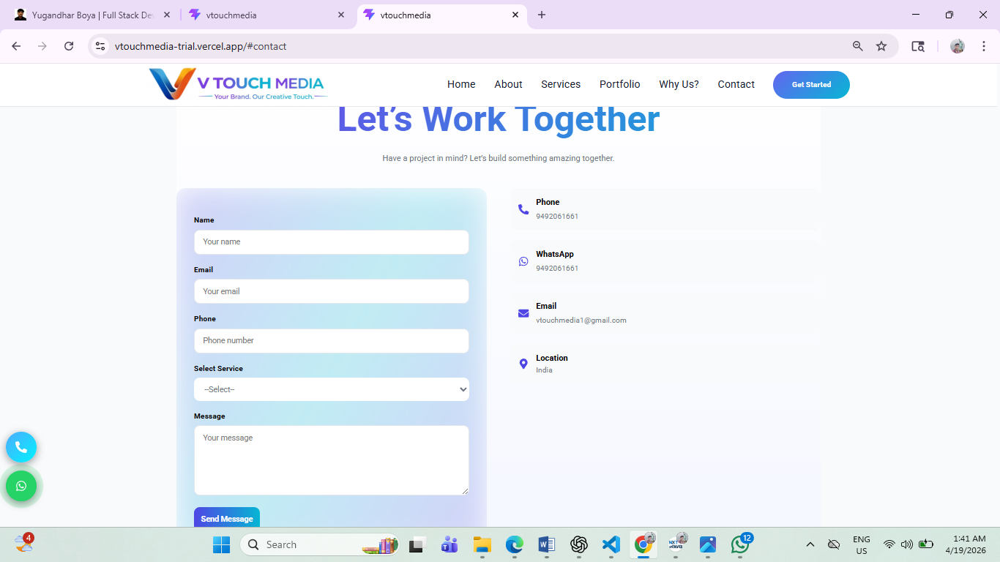

# 🎬 VTouch Media Website

A modern and responsive **Digital Media Agency Website** developed using React.
This project was built as a real-world freelance solution to help a media business establish a strong online presence.

---

## 🌐 Live Website

👉 https://vtouchmedia.com

---

## 💼 Project Overview

This is a **freelance client project** developed for a digital media agency.

The goal was to:

- Create a modern and visually appealing website
- Showcase services and portfolio effectively
- Generate leads through a contact system
- Ensure smooth performance across all devices

---

## 🚀 Key Features

- ✨ Clean and modern UI design
- 📱 Fully responsive layout
- 🎯 Services and portfolio sections
- 📞 Contact form with EmailJS integration
- 💬 WhatsApp direct contact option
- ⚡ Smooth user experience and navigation

---

## 🛠 Tech Stack

- React.js
- JavaScript (ES6+)
- CSS3 (Custom Styling)
- EmailJS
- React Icons

---

## 🧩 Development Process

This project was completed in structured phases:

1. UI Design – Designed a modern and user-friendly interface
2. Structure Design – Planned component-based architecture
3. Version Control – Managed using Git & GitHub
4. Deployment – Connected with custom domain (vtouchmedia.com)
5. Maintenance – Provided ongoing support and UI improvements based on client feedback

---

## 🤝 Responsibilities

- Designed complete UI/UX for the website
- Developed responsive frontend using React
- Integrated EmailJS for contact functionality
- Ensured performance and usability across devices
- Handled post-deployment updates and improvements

---

## 📈 Outcome

- Successfully launched a business website for a digital media agency
- Improved online presence and service visibility
- Built a scalable and maintainable frontend structure

---

## 📧 Contact

For any collaboration or freelance work:

- 📞 Phone: 9848181206
- 📩 Email: [boyayugandhar135@gmail.com](mailto:boyayugandhar135@gmail.com)

---

## 👤 Author

Yugandhar Boya
Fullstack Developer | Freelance Web Developer

---

## ⭐ Note

This project represents a real-world freelance experience focused on delivering business value through design and development.

## 📸 Screenshots

